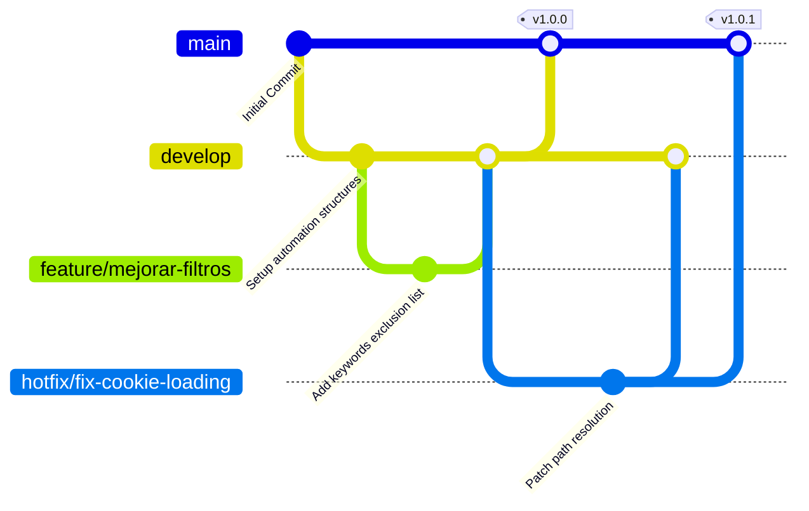

# Job Applications Scanner & Auto-Applier

Este proyecto automatiza la búsqueda y postulación a ofertas de empleo en la plataforma oficial del Ministerio de Trabajo de Ecuador ("Encuentra Empleo") para salarios superiores a $1000 USD, basándose en el perfil profesional del usuario y excluyendo puestos no aplicables.

## Arquitectura y Componentes

- **`playwright_apply.py`**: El script principal en Python que utiliza Playwright (Headless Chromium) para iniciar sesión (usando las cookies), buscar ofertas por rango salarial, filtrar palabras clave no deseadas, abrir los detalles y aplicar automáticamente.
- **`run_playwright.sh`**: Wrapper de shell script que inicializa el entorno (`PATH`, `HOME`), crea el directorio de logs y redirige la salida del script principal.
- **`com.statick.jobapplications.plist`**: Archivo de configuración de macOS LaunchAgent que programa la ejecución diaria automática del script.
- **`config/cookies.json`**: Contiene la sesión activa (`JSESSIONID` y `NSC_...` cookies) para interactuar con la plataforma.
- **`data/applications.md`**: El registro histórico de todas las postulaciones realizadas con éxito, incluyendo la fecha, cargo, empresa y enlace al screenshot del resultado de postulación.

---

## Automatización y Programación Diaria

Para evitar las limitaciones de TCC en macOS que bloquean las tareas de `cron` al acceder a carpetas de usuario como `~/Documents`, hemos implementado la programación nativa a través de un **LaunchAgent** de macOS.

### Configuración del LaunchAgent

El agente está configurado para ejecutarse **todos los días a las 22:00**.

El archivo plist está en:
`~/Library/LaunchAgents/com.statick.jobapplications.plist`

Y apunta directamente a:
`/Users/statick/Documents/job_applications/run_playwright.sh`

### Comandos de Control

Puedes gestionar el agente desde la terminal usando los siguientes comandos:

- **Verificar el estado del Agente:**
  ```bash
  launchctl list | grep jobapplications
  ```
  *(Si aparece en la lista, está cargado correctamente y listo para ejecutarse en su horario).*

- **Ejecutar manualmente en este momento (Prueba):**
  ```bash
  launchctl start com.statick.jobapplications
  ```

- **Detener o descargar el Agente (Desactivar automatización):**
  ```bash
  launchctl unload ~/Library/LaunchAgents/com.statick.jobapplications.plist
  ```

- **Cargar/Recargar el Agente después de hacer cambios:**
  ```bash
  launchctl load ~/Library/LaunchAgents/com.statick.jobapplications.plist
  ```

---

## Logs y Monitoreo

La ejecución automática guarda el historial detallado de salidas en:
- `logs/execution.log` (salida unificada de stdout y stderr del script de python)
- `logs/launchd_stdout.log` (salida estándar de launchd)
- `logs/launchd_stderr.log` (salida de errores de launchd)

Las notificaciones del sistema se enviarán nativamente a macOS usando AppleScript (`osascript`) para informarte sobre el éxito de las postulaciones o si la sesión ha expirado y requiere actualizar las cookies.

---

## Modelo de Ramas (GitFlow Tree)

Este proyecto sigue el modelo de ramificación **GitFlow** para mantener el código de producción estable y organizar el desarrollo de nuevas características o parches de forma limpia.

### Representación Visual



### Estructura de Ramas

- **`main`**: Rama de producción. Contiene código 100% estable y probado. Toda modificación en esta rama se etiqueta con una versión (Tag).
- **`develop`**: Rama de integración. Aquí se consolidan las nuevas características preparándose para la siguiente versión estable.
- **`feature/*`**: Ramas temporales para desarrollar nuevas características (ej. `feature/mejorar-busqueda`). Nacen de `develop` y se fusionan de vuelta en `develop`.
- **`hotfix/*`**: Ramas de emergencia para solucionar errores críticos en producción (ej. `hotfix/actualizar-selectores`). Nacen de `main` y se fusionan tanto en `main` como en `develop`.

---

## Flujo de Trabajo y Uso

### 1. Preparación del Entorno Local

Asegúrate de tener instalado Python 3.10+ y los paquetes de automatización:

```bash
# Clonar el repositorio
git clone https://github.com/statick88/job_applications.git
cd job_applications

# Crear e instalar dependencias en entorno virtual (Recomendado)
python3 -m venv .venv
source .venv/bin/activate
pip install playwright beautifulsoup4 pyyaml

# Instalar los navegadores de Playwright
playwright install chromium
```

### 2. Configurar las Credenciales del Portal

Crea el archivo de configuración con tu sesión activa de Encuentra Empleo:

```bash
# Crear directorio de configuración
mkdir -p config

# Guardar tus cookies activas (Este archivo está protegido en .gitignore)
cat <<EOF > config/cookies.json
{
  "JSESSIONID": "TU_JSESSIONID_AQUI",
  "NSC_JOmnkwatc53jecrcfmkoaierrq1sab2": "TU_NSC_COOKIE_AQUI"
}
EOF
```

### 3. Crear una Nueva Característica (Feature Branch)

Si vas a realizar cambios o mejoras al script (ej. optimizar la detección del botón "Aplicar"):

```bash
# Asegúrate de estar en develop y al día
git checkout develop
git pull origin develop

# Crear rama de feature
git checkout -b feature/optimizar-boton-aplicar

# Realiza tus cambios en el código...
# Realiza commits siguiendo convenciones semánticas (Conventional Commits)
git add playwright_apply.py
git commit -m "feat: optimize apply button locator and add robust retry mechanism"

# Subir rama para revisión
git push -u origin feature/optimizar-boton-aplicar
```

Una vez probado, realiza un Pull Request hacia la rama `develop` en GitHub.

### 4. Lanzar un Hotfix (Bugfix Urgente)

Si la plataforma de Encuentra Empleo cambia sus selectores en producción y rompe el script:

```bash
# Crear rama de hotfix desde main
git checkout main
git checkout -b hotfix/fix-selectors-change

# Aplicar el fix rápido...
git add playwright_apply.py
git commit -m "fix: update selectors to match new portal HTML structure"

# Fusionar en main y etiquetar versión
git checkout main
git merge hotfix/fix-selectors-change
git tag -a v1.0.1 -m "Versión 1.0.1: Corrección de selectores por cambio de portal"
git push origin main --tags

# IMPORTANTE: Fusionar también de vuelta a develop para no perder el fix
git checkout develop
git merge hotfix/fix-selectors-change
git push origin develop

# Eliminar rama local
git branch -d hotfix/fix-selectors-change
```
